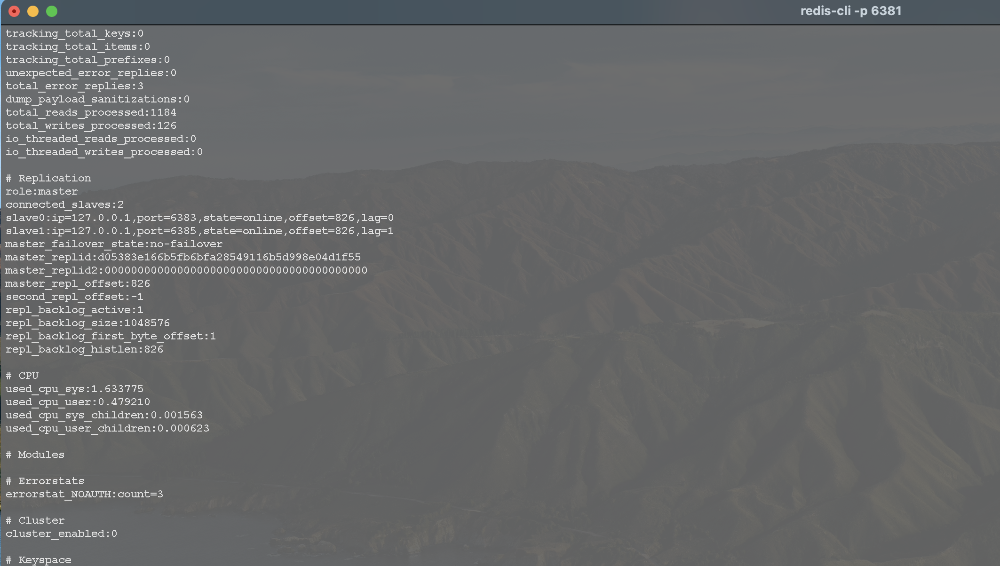

# redis_test

redis环境搭建测试(单机环境模拟)


## 主从(1主2从3哨兵)


sentinel_test目录下


### 环境(单机模拟)

| IP        | 角色                                    | redis版本   |
| --------- | --------------------------------------- | ----------- |
| 127.0.0.1 | master(port: 6381),sentinel(port: 6382) | redis-6.2.3 |
| 127.0.0.1 | slave(port: 6383),sentinel(port: 6384)  | redis-6.2.3 |
| 127.0.0.1 | salve(port: 6385),sentinel(port: 6386)  | redis-6.2.3 |

 ### 主从配置文件

```properties
# cat master/redis-master.conf

#表示redis允许所有地址连接。默认127.0.0.1，仅允许本地连接。
bind 0.0.0.0
#允许redis后台运行
daemonize yes
#设置redis日志存放路径
logfile ./master/tmp/redis_master_6381.log
#设置redis密码
requirepass "main"
#设置为no，允许外部网络访问
protected-mode no
#修改redis监听端口(可以自定义)
port 6381
#pid存放目录
pidfile ./master/tmp/redis_6381.pid
#工作目录，需要创建好目录,可自定义
dir ./master/tmp
#设置redis密码
requirepass 123456
#主从同步master的密码
masterauth 123456

```


```properties
# cat slave/redis-slave.conf

#表示redis允许所有地址连接。默认127.0.0.1，仅允许本地连接。
bind 0.0.0.0
#允许redis后台运行
daemonize yes
#设置redis日志存放路径
logfile ./slave/tmp/redis_slave_6383.log
#设置为no，允许外部网络访问
protected-mode no
#修改redis监听端口(可以自定义)
port 6383
#pid存放目录
pidfile ./slave/tmp/redis_6383.pid
#工作目录，需要创建好目录,可自定义
dir ./slave/tmp
#设置redis密码
requirepass 123456
#主从同步master的密码
masterauth 123456
#复制主
replicaof 127.0.0.1 6381
```


```properties
# cat slave2/redis-slave2.conf

#表示redis允许所有地址连接。默认127.0.0.1，仅允许本地连接。
bind 0.0.0.0
#允许redis后台运行
daemonize yes
#设置redis日志存放路径
logfile ./slave2/tmp/redis_slave_6385.log
#设置为no，允许外部网络访问
protected-mode no
#修改redis监听端口(可以自定义)
port 6385
#pid存放目录
pidfile ./slave2/tmp/redis_6385.pid
#工作目录，需要创建好目录,可自定义
dir ./slave2/tmp
#设置redis密码
requirepass 123456
#主从同步master的密码
masterauth 123456
#复制主
replicaof 127.0.0.1 6381
```


启动1主2从

```sh
# cat start_master.sh

#!/bin/sh

../redis-6.2.3/src/redis-server ./master/redis-master.conf
```

```sh
# cat start_slave.sh

#!/bin/sh

../redis-6.2.3/src/redis-server ./slave/redis-slave.conf
```

```sh
# cat start_slave2.sh

#!/bin/sh

../redis-6.2.3/src/redis-server ./slave2/redis-slave2.conf
```


1主2从启动成功：





### Sentinel配置文件

```properties
# cat master/sentinel_master.conf


#修改Sentinel监听端口
port 6382

#允许Sentinel后台运行
daemonize yes

#设置Sentinel日志存放路径
logfile "./master/sentinel/tmp/redis-sentinel.log"

#工作目录，需要创建好目录,可自定义
dir "/Users/caizh/github/redis_test/sentinel_test/master/sentinel/tmp"

#Sentinel监听redis主节点
#redis01：master名称可自定义
#10.10.41.111 7000 ：redis主节点IP和端口
#2 ：表示多少个Sentinel认为redis主节点失效时，才算真正失效
sentinel monitor redis01 127.0.0.1 6381 2

#配置失效时间，master会被这个sentinel主观地认为是不可用的，单位毫秒
sentinel down-after-milliseconds redis01 10000

#若sentinel在该配置值内未能完成master/slave自动切换，则认为本次failover失败。
sentinel failover-timeout redis01 60000

#在发生failover主备切换时最多可以有多少个slave同时对新的master进行同步。
sentinel parallel-syncs redis01 2

#设置连接master和slave时的密码，注意的是sentinel不能分别为master和slave设置不同的密码，因此master和slave的密码应该设置相同
sentinel auth-pass redis01 123456
# 以下为启动sentinel后自动追加
# Generated by CONFIG REWRITE
protected-mode no
pidfile "/var/run/redis.pid"
user default on nopass sanitize-payload ~* &* +@all
sentinel myid 36b66820abce13059102a051e4b90f2692c0f154
sentinel config-epoch redis01 0
sentinel leader-epoch redis01 0
sentinel current-epoch 0
sentinel known-replica redis01 127.0.0.1 6385
sentinel known-replica redis01 127.0.0.1 6383
sentinel known-sentinel redis01 127.0.0.1 6386 14f907cb15f07a3f140afc564ca67f02f44ed347
sentinel known-sentinel redis01 127.0.0.1 6384 b1181c457d0772b2e7c358e9208d5d7f9d0d5b70
```


```properties
# cat slave/sentinel_slave.conf


#修改Sentinel监听端口
port 6384

#允许Sentinel后台运行
daemonize yes

#设置Sentinel日志存放路径
logfile "./slave/sentinel/tmp/redis-sentinel.log"

#工作目录，需要创建好目录,可自定义
dir "/Users/caizh/github/redis_test/sentinel_test/slave/sentinel/tmp"

#Sentinel监听redis主节点
#redis01：master名称可自定义
#10.10.41.111 7000 ：redis主节点IP和端口
#2 ：表示多少个Sentinel认为redis主节点失效时，才算真正失效
sentinel monitor redis01 127.0.0.1 6381 2

#配置失效时间，master会被这个sentinel主观地认为是不可用的，单位毫秒
sentinel down-after-milliseconds redis01 10000

#若sentinel在该配置值内未能完成master/slave自动切换，则认为本次failover失败。
sentinel failover-timeout redis01 60000

#在发生failover主备切换时最多可以有多少个slave同时对新的master进行同步。
sentinel parallel-syncs redis01 2

#设置连接master和slave时的密码，注意的是sentinel不能分别为master和slave设置不同的密码，因此master和slave的密码应该设置相同
sentinel auth-pass redis01 123456
# 以下为启动sentinel后自动追加
# Generated by CONFIG REWRITE
protected-mode no
pidfile "/var/run/redis.pid"
user default on nopass sanitize-payload ~* &* +@all
sentinel myid b1181c457d0772b2e7c358e9208d5d7f9d0d5b70
sentinel config-epoch redis01 0
sentinel leader-epoch redis01 0
sentinel current-epoch 0
sentinel known-replica redis01 127.0.0.1 6383
sentinel known-replica redis01 127.0.0.1 6385
sentinel known-sentinel redis01 127.0.0.1 6386 14f907cb15f07a3f140afc564ca67f02f44ed347
sentinel known-sentinel redis01 127.0.0.1 6382 36b66820abce13059102a051e4b90f2692c0f154
```


```properties
# cat slave2/sentinel_slave2.conf


#修改Sentinel监听端口
port 6386

#允许Sentinel后台运行
daemonize yes

#设置Sentinel日志存放路径
logfile "./slave2/sentinel/tmp/redis-sentinel.log"

#工作目录，需要创建好目录,可自定义
dir "/Users/caizh/github/redis_test/sentinel_test/slave2/sentinel/tmp"

#Sentinel监听redis主节点
#redis01：master名称可自定义
#10.10.41.111 7000 ：redis主节点IP和端口
#2 ：表示多少个Sentinel认为redis主节点失效时，才算真正失效
sentinel monitor redis01 127.0.0.1 6381 2

#配置失效时间，master会被这个sentinel主观地认为是不可用的，单位毫秒
sentinel down-after-milliseconds redis01 10000

#若sentinel在该配置值内未能完成master/slave自动切换，则认为本次failover失败。
sentinel failover-timeout redis01 60000

#在发生failover主备切换时最多可以有多少个slave同时对新的master进行同步。
sentinel parallel-syncs redis01 2

#设置连接master和slave时的密码，注意的是sentinel不能分别为master和slave设置不同的密码，因此master和slave的密码应该设置相同
sentinel auth-pass redis01 123456
# 以下为启动sentinel后自动追加
# Generated by CONFIG REWRITE
protected-mode no
pidfile "/var/run/redis.pid"
user default on nopass ~* &* +@all
sentinel myid 14f907cb15f07a3f140afc564ca67f02f44ed347
sentinel config-epoch redis01 0
sentinel leader-epoch redis01 0
sentinel current-epoch 0
sentinel known-replica redis01 127.0.0.1 6385
sentinel known-replica redis01 127.0.0.1 6383
sentinel known-sentinel redis01 127.0.0.1 6384 b1181c457d0772b2e7c358e9208d5d7f9d0d5b70
sentinel known-sentinel redis01 127.0.0.1 6382 36b66820abce13059102a051e4b90f2692c0f154

```


### 验证sentinel

停止master后，slave(6383端口)自动成为master:


重启停掉的原master（6381端口）后,作为6383的slave:


[源代码](https://github.com/zhhongCai/redis_test.git)


#### 参考

[Redis主从配置(一主二从三哨兵)](https://www.jianshu.com/p/e71c5a3a7162)


## 集群

### 环境


